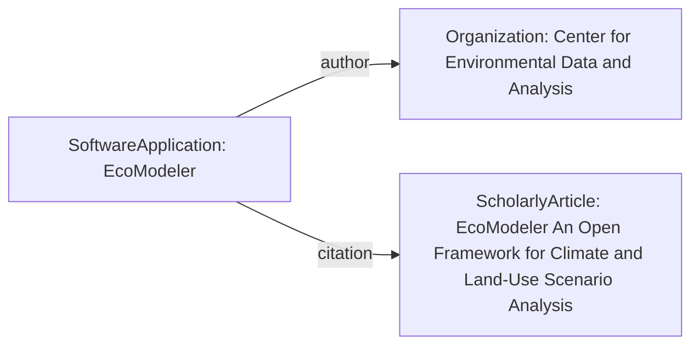

# Guidance for using ComputationalTool

The [ComputationalTool](/profiles/ComputationalTool/) profile fits into the schema.org hierarchy as follows:

[Thing](http://schema.org/Thing) > [CreativeWork](http://schema.org/CreativeWork) > [SoftwareApplication](http://schema.org/SoftwareApplication)

## Example using SoftwareApplication
**EcoModeler** is a (fictional) software suite designed to model carbon emissions and land-use scenarios under various climate policy assumptions. It integrates GIS data with predictive modeling for climate science research.

### JSON-LD code

```json 
{
  "@context": "https://schema.org",
  "@type": "SoftwareApplication",
  "http://purl.org/dc/terms/conformsTo": {
    "@id": "https://bioschemas.org/profiles/ComputationalTool/1.0-RELEASE",
    "@type": "CreativeWork"
  },
  "name": "EcoModeler",
  "description": "A scientific modeling tool for simulating carbon emissions, land-use change, and policy impact on global climate scenarios.",
  "url": "https://ecomod.org",
  "applicationCategory": "ScienceApplication",
  "applicationSubCategory": "Climate Modeling Tool",
  "softwareVersion": "3.4.2",
  "featureList": [
    "Carbon emissions forecasting",
    "Land-use change simulation",
    "Policy scenario comparison",
    "Integrated GIS data support"
  ],
  "author": {
    "@type": "Organization",
    "name": "Center for Environmental Data and Analysis"
  },
  "citation": {
    "@type": "ScholarlyArticle",
    "name": "EcoModeler: An Open Framework for Climate and Land-Use Scenario Analysis",
    "url": "https://doi.org/10.1016/j.envsoft.2024.104842"
  },
  "license": "https://www.gnu.org/licenses/gpl-3.0.en.html",
  "codeRepository": "https://github.com/envdata/ecomod",
  "programmingLanguage": "R",
  "keywords": ["climate modeling", "carbon emissions", "environmental science", "GIS"]
}
```

### Diagram


