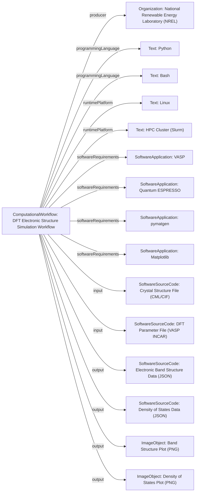

# Guidance for using ComputationalWorkflow

The [ComputationalWorkflow](/profiles/ComputationalWorkflow/) profile fits into the schema.org hierarchy as follows:

[Thing](http://schema.org/Thing) > [CreativeWork](http://schema.org/CreativeWork) > [SoftwareSourceCode](http://schema.org/SoftwareSourceCode)

This profile is designed to describe a series of computational steps or processes, often used in scientific research for data analysis, simulation, or modeling. It captures essential metadata such as the programming languages used, required software, input/output data types, and execution environment.

## Example using ComputationalWorkflow
A workflow designed to simulate the electronic band structure and density of states for novel semiconductor materials using density functional theory (DFT) principles. This workflow integrates multiple software tools and scripts to automate the calculation, analysis, and visualization of material properties.

### JSON-LD code

```json
{
    "@context": "https://schema.org",
    "@type": "ComputationalWorkflow",
    "http://purl.org/dc/terms/conformsTo": {
        "@id": "https://bioschemas.org/profiles/ComputationalWorkflow/1.0-RELEASE",
        "@type": "CreativeWork"
    },
    "name": "DFT Electronic Structure Simulation Workflow",
    "description": "A robust computational workflow for performing Density Functional Theory (DFT) simulations to predict and analyze the electronic band structure and density of states of semiconductor materials. The workflow automates input file generation, execution of DFT codes, and post-processing of results, including visualization.",
    "keywords": ["DFT", "density functional theory", "materials science", "semiconductor", "band structure", "density of states", "computational physics", "VASP", "Quantum ESPRESSO"],
    "applicationCategory": "Simulation",
    "programmingLanguage": ["Python", "Bash"],
    "runtimePlatform": ["Linux", "HPC Cluster (Slurm)"],
    "softwareRequirements": [
        {
            "@type": "SoftwareApplication",
            "name": "VASP",
            "url": "https://www.vasp.at/"
        },
        {
            "@type": "SoftwareApplication",
            "name": "Quantum ESPRESSO",
            "url": "https://www.quantum-espresso.org/"
        },
        {
            "@type": "SoftwareApplication",
            "name": "pymatgen",
            "url": "https://pymatgen.org/"
        },
        {
            "@type": "SoftwareApplication",
            "name": "Matplotlib",
            "url": "https://matplotlib.org/"
        }
    ],
    "input": [
        {
            "@type": "SoftwareSourceCode",
            "name": "Crystal Structure File",
            "encodingFormat": "Chemical Markup Language (CML) or Crystallographic Information File (CIF)",
            "description": "Input file describing the atomic positions and lattice parameters of the material."
        },
        {
            "@type": "SoftwareSourceCode",
            "name": "DFT Parameter File",
            "encodingFormat": "Text/VASP INCAR format",
            "description": "Configuration file specifying DFT calculation parameters (e.g., k-point mesh, exchange-correlation functional)."
        }
    ],
    "output": [
        {
            "@type": "SoftwareSourceCode",
            "name": "Electronic Band Structure Data",
            "encodingFormat": "Text/JSON",
            "description": "Data points for the calculated electronic band structure along high-symmetry k-paths."
        },
        {
            "@type": "SoftwareSourceCode",
            "name": "Density of States Data",
            "encodingFormat": "Text/JSON",
            "description": "Data for the total and projected density of states."
        },
        {
            "@type": "ImageObject",
            "name": "Band Structure Plot",
            "encodingFormat": "image/png",
            "description": "Visual representation of the electronic band structure."
        },
        {
            "@type": "ImageObject",
            "name": "Density of States Plot",
            "encodingFormat": "image/png",
            "description": "Visual representation of the density of states."
        }
    ],
    "producer": {
        "@type": "Organization",
        "name": "National Renewable Energy Laboratory (NREL)",
        "url": "https://www.nrel.gov/"
    },
    "license": "https://opensource.org/licenses/Apache-2.0",
    "dateCreated": "2023-10-26",
    "version": "1.2",
    "url": "https://github.com/materials-workflows/dft-bandstructure-workflow",
    "citation": "J. Doe et al., 'Automated DFT Workflows for Semiconductor Material Discovery', Journal of Computational Materials, 2024, DOI: 10.xxxx/j.jcomat.2024.xxxxxx"
}
```

### Diagram

