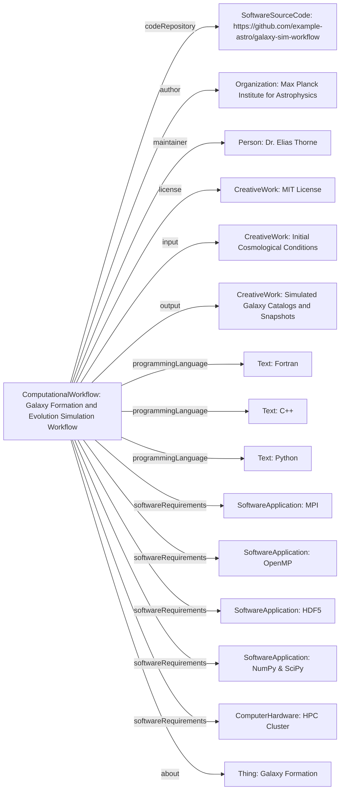

# Guidance for using ComputationalWorkflow

The [ComputationalWorkflow](/profiles/ComputationalWorkflow/) profile fits into the schema.org hierarchy as follows:

[Thing](http://schema.org/Thing) > [CreativeWork](http://schema.org/CreativeWork) > [SoftwareSourceCode](http://schema.org/SoftwareSourceCode) > [ComputationalWorkflow](https://bioschemas.org/profiles/ComputationalWorkflow/)

## Example using ComputationalWorkflow
A complex simulation workflow designed to model the formation and evolution of galaxies from initial cosmological conditions. It incorporates N-body simulations for dark matter and hydrodynamics for baryonic matter, producing detailed properties of galaxies over cosmic time.

### JSON-LD code

```json
{
    "@context": "https://schema.org",
    "@type": "ComputationalWorkflow",
    "http://purl.org/dc/terms/conformsTo": {
        "@id": "https://bioschemas.org/profiles/ComputationalWorkflow/1.0-RELEASE",
        "@type": "CreativeWork"
    },
    "name": "Galaxy Formation and Evolution Simulation Workflow",
    "description": "A comprehensive computational workflow for simulating the formation and co-evolution of dark matter halos and baryonic structures, such as stars and gas, into galaxies within a cosmological context. It includes modules for initial condition generation, N-body dynamics, smoothed particle hydrodynamics (SPH), stellar feedback, black hole accretion, and post-processing analysis.",
    "keywords": [
        "astrophysics",
        "cosmology",
        "galaxy evolution",
        "N-body simulation",
        "SPH",
        "dark matter",
        "baryonic matter",
        "supercomputers"
    ],
    "programmingLanguage": ["Fortran", "C++", "Python"],
    "applicationCategory": "Computational Astrophysics",
    "softwareRequirements": [
        {
            "@type": "SoftwareApplication",
            "name": "MPI (Message Passing Interface)",
            "description": "For parallel execution across multiple nodes.",
            "url": "https://www.mpi-forum.org/"
        },
        {
            "@type": "SoftwareApplication",
            "name": "OpenMP",
            "description": "For shared-memory parallelism within a node.",
            "url": "https://www.openmp.org/"
        },
        {
            "@type": "SoftwareApplication",
            "name": "HDF5",
            "description": "For efficient storage and retrieval of simulation data.",
            "url": "https://www.hdfgroup.org/solutions/hdf5/"
        },
        {
            "@type": "SoftwareApplication",
            "name": "NumPy & SciPy",
            "description": "Python libraries for numerical operations and scientific computing.",
            "url": "https://numpy.org/"
        },
        {
            "@type": "ComputerHardware",
            "name": "High-Performance Computing (HPC) Cluster",
            "description": "Requires significant computational resources (CPU cores, RAM, storage) typically found in supercomputing centers."
        }
    ],
    "operatingSystem": "Linux",
    "license": "https://opensource.org/licenses/MIT",
    "codeRepository": "https://github.com/example-astro/galaxy-sim-workflow",
    "author": {
        "@type": "Organization",
        "name": "Max Planck Institute for Astrophysics",
        "url": "https://www.mpa-garching.mpg.de/"
    },
    "maintainer": {
        "@type": "Person",
        "name": "Dr. Elias Thorne",
        "affiliation": {
            "@type": "Organization",
            "name": "Cosmic Simulations Research Group"
        }
    },
    "version": "2.1.0",
    "dateModified": "2024-03-10",
    "schemaVersion": "https://schema.org/docs/releases.html#v20.0",
    "creativeWorkStatus": "Active",
    "url": "https://example-astro.org/galaxy-sim-workflow",
    "about": {
        "@type": "Thing",
        "name": "Galaxy Formation",
        "description": "The astrophysical process by which galaxies form and evolve over cosmic timescales."
    },
    "input": {
        "@type": "CreativeWork",
        "name": "Initial Cosmological Conditions",
        "description": "Input files specifying the initial distribution of dark matter and baryonic particles, including cosmological parameters (e.g., Omega_m, Omega_b, H_0, sigma_8). Typically generated by a separate perturbation code."
    },
    "output": {
        "@type": "CreativeWork",
        "name": "Simulated Galaxy Catalogs and Snapshots",
        "description": "Output data including particle snapshots at various cosmic times, properties of identified galaxies and halos (e.g., mass, stellar mass, star formation rates, merger trees), and derived observable quantities."
    }
}
```

### Diagram

