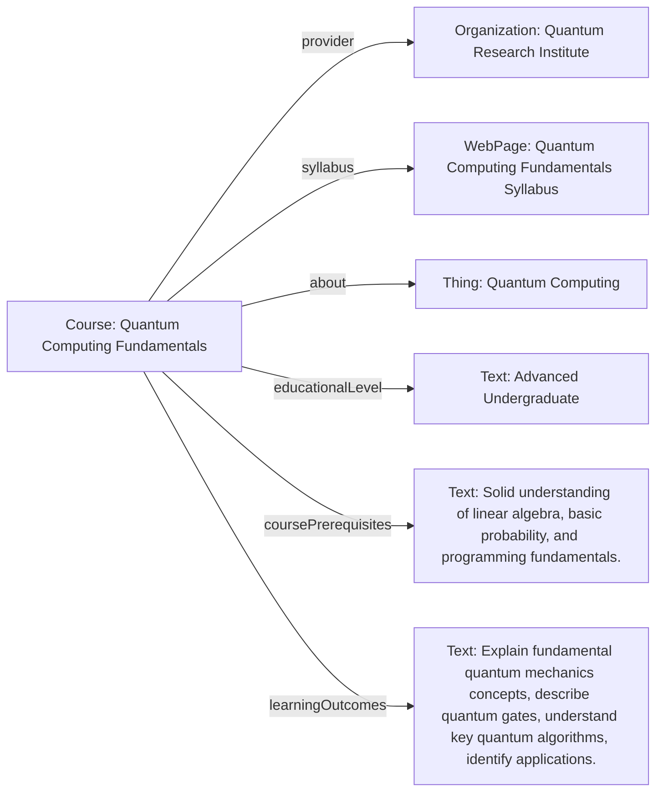

# Guidance for using Course

The [Course](https://schema.org/Course) profile fits into the schema.org hierarchy as follows:

[Thing](http://schema.org/Thing) > [CreativeWork](http://schema.org/CreativeWork) > [Course](https://schema.org/Course)

## Example using Course
A comprehensive online course introducing the foundational principles of quantum computing, including qubits, quantum gates, entanglement, and key quantum algorithms. Designed for advanced undergraduate students in computer science or physics.

### JSON-LD code

```json
{
    "@context": "https://schema.org",
    "@type": "Course",
    "http://purl.org/dc/terms/conformsTo": {
        "@id": "https://bioschemas.org/profiles/Course/1.0-RELEASE",
        "@type": "CreativeWork"
    },
    "name": "Quantum Computing Fundamentals",
    "description": "An introductory course exploring the foundational principles of quantum mechanics applied to computation, covering qubits, quantum gates, entanglement, and fundamental quantum algorithms like Deutsch-Jozsa and Grover's algorithm.",
    "keywords": ["quantum computing", "quantum mechanics", "algorithms", "Qubit", "quantum entanglement", "computer science", "computational physics"],
    "provider": {
        "@type": "Organization",
        "name": "Quantum Research Institute",
        "url": "https://www.quantumresearchinstitute.org"
    },
    "educationalLevel": "Advanced Undergraduate",
    "coursePrerequisites": "Solid understanding of linear algebra, basic probability, and programming fundamentals.",
    "learningOutcomes": [
        "Explain the fundamental concepts of quantum mechanics relevant to computation (superposition, entanglement, measurement).",
        "Describe common quantum gates and construct simple quantum circuits.",
        "Understand the principles behind key quantum algorithms like Deutsch-Jozsa and Grover's algorithm.",
        "Identify potential applications and challenges in quantum computing."
    ],
    "syllabus": {
        "@type": "WebPage",
        "url": "https://www.quantumresearchinstitute.org/courses/quantum-computing-fundamentals/syllabus",
        "name": "Quantum Computing Fundamentals Syllabus"
    },
    "startDate": "2024-09-02",
    "endDate": "2024-12-13",
    "courseCode": "QCI-CS101",
    "about": {
        "@type": "Thing",
        "name": "Quantum Computing"
    },
    "inLanguage": "en",
    "url": "https://www.quantumresearchinstitute.org/courses/quantum-computing-fundamentals"
}
```

### Diagram

