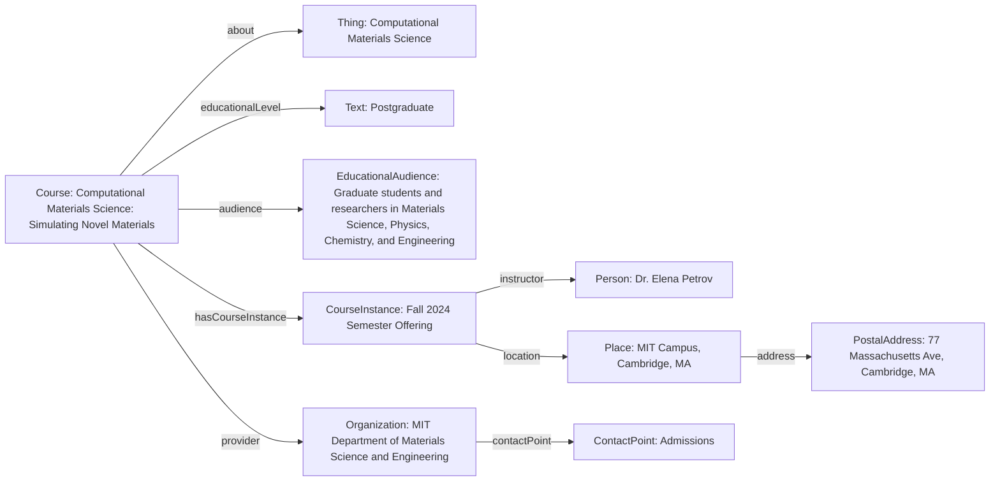

# Guidance for using Course

The [Course](http://schema.org/Course) profile fits into the schema.org hierarchy as follows:

[Thing](http://schema.org/Thing) > [CreativeWork](http://schema.org/CreativeWork) > [Course](http://schema.org/Course)

!!! warning
    The following examples have been written with the support of generative AI and may be incomplete or inaccurate.
    Please [contact us](https://github.com/schemas-science/schemas-science.github.io/issues/new) with any feedback, suggestions or corrections.

## Example using Course
An advanced university course exploring theoretical and computational methods used to predict and understand the properties of materials. Aimed at postgraduate students and researchers in related scientific and engineering disciplines.

### JSON-LD code

```json
{
    "@context": "https://schema.org",
    "@type": "Course",
    "http://purl.org/dc/terms/conformsTo": {
        "@id": "https://bioschemas.org/profiles/Course/1.0-RELEASE",
        "@type": "CreativeWork"
    },
    "name": "Computational Materials Science: Simulating Novel Materials",
    "description": "An advanced course focusing on theoretical and computational methods to predict and understand the properties of materials, including density functional theory, molecular dynamics, and Monte Carlo simulations. Practical sessions involve using open-source software packages for hands-on experience in materials discovery and characterization.",
    "keywords": ["materials science", "computational physics", "density functional theory", "molecular dynamics", "materials discovery", "simulation", "condensed matter physics", "computational chemistry"],
    "audience": {
        "@type": "EducationalAudience",
        "audienceType": "Graduate students and researchers in Materials Science, Physics, Chemistry, and Engineering"
    },
    "educationalLevel": "Postgraduate",
    "about": {
        "@type": "Thing",
        "name": "Computational Materials Science",
        "description": "The interdisciplinary field that uses computational methods to understand and predict the properties of materials."
    },
    "provider": {
        "@type": "Organization",
        "name": "MIT Department of Materials Science and Engineering",
        "url": "https://dmse.mit.edu/",
        "contactPoint": {
            "@type": "ContactPoint",
            "contactType": "Admissions",
            "email": "dmse-grad-admissions@mit.edu"
        }
    },
    "hasCourseInstance": {
        "@type": "CourseInstance",
        "name": "Fall 2024 Semester Offering",
        "courseMode": "Blended",
        "startDate": "2024-09-03",
        "endDate": "2024-12-13",
        "instructor": {
            "@type": "Person",
            "name": "Dr. Elena Petrov",
            "url": "https://dmse.mit.edu/people/elena-petrov"
        },
        "location": {
            "@type": "Place",
            "name": "MIT Campus, Cambridge, MA",
            "address": {
                "@type": "PostalAddress",
                "streetAddress": "77 Massachusetts Ave",
                "addressLocality": "Cambridge",
                "addressRegion": "MA",
                "postalCode": "02139",
                "addressCountry": "US"
            }
        },
        "url": "https://dmse.mit.edu/courses/cms-777-fall-2024"
    }
}
```

### Diagram

