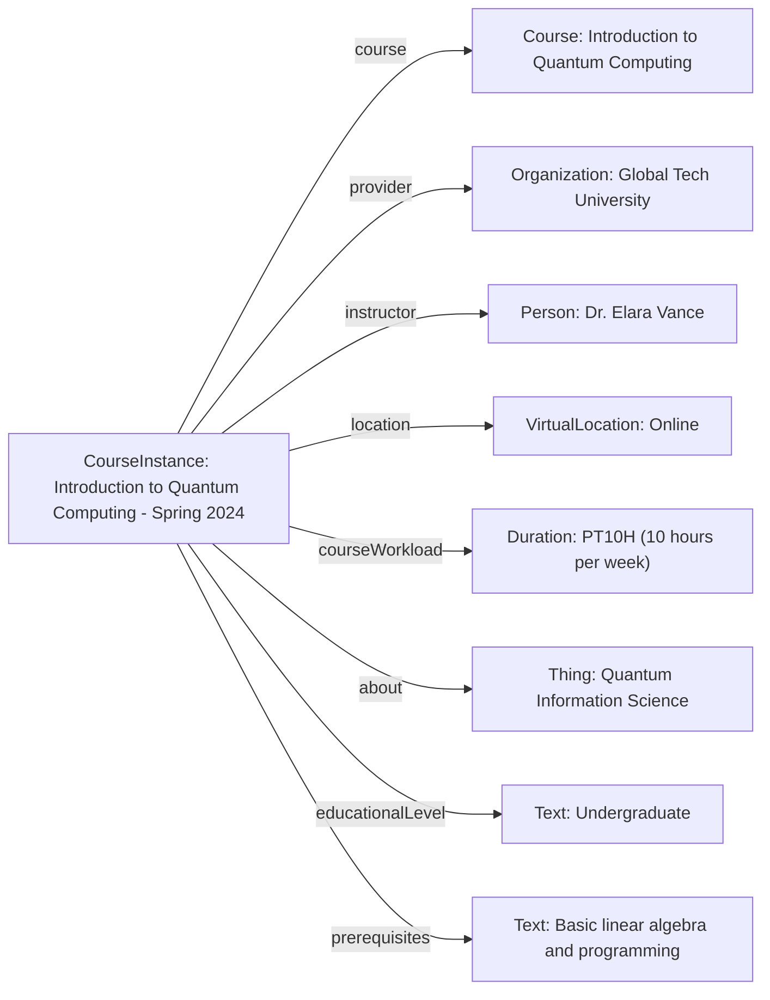

# Guidance for using CourseInstance

The [CourseInstance](https://schema.org/CourseInstance) profile fits into the schema.org hierarchy as follows:

[Thing](http://schema.org/Thing) > [Event](http://schema.org/Event) > [CourseInstance](https://schema.org/CourseInstance)

## Example using CourseInstance
An online course instance titled "Introduction to Quantum Computing," designed for undergraduate students with a basic programming background. It covers fundamental concepts of quantum mechanics applied to computation, basic quantum algorithms, and practical programming with quantum SDKs.

### JSON-LD code

```json
{
  "@context": "https://schema.org",
  "@type": "CourseInstance",
  "http://purl.org/dc/terms/conformsTo": {
    "@id": "https://bioschemas.org/profiles/CourseInstance/1.0-RELEASE",
    "@type": "CreativeWork"
  },
  "name": "Introduction to Quantum Computing - Spring 2024",
  "description": "This course instance provides a comprehensive introduction to the foundational principles of quantum computing. It covers quantum mechanics essentials, quantum gates, circuits, and explores key algorithms like Grover's and Shor's. Hands-on exercises with a quantum SDK (e.g., Qiskit) are included.",
  "keywords": ["quantum computing", "quantum mechanics", "quantum algorithms", "Qiskit", "computational science"],
  "courseMode": "Online",
  "startDate": "2024-03-01",
  "endDate": "2024-05-31",
  "location": {
    "@type": "VirtualLocation",
    "url": "https://example.edu/quantum-computing-spring2024"
  },
  "provider": {
    "@type": "Organization",
    "name": "Global Tech University",
    "url": "https://example.edu"
  },
  "instructor": {
    "@type": "Person",
    "name": "Dr. Elara Vance",
    "url": "https://example.edu/elara-vance",
    "affiliation": {
      "@type": "Organization",
      "name": "Department of Computer Science"
    }
  },
  "courseWorkload": "PT10H",
  "course": {
    "@type": "Course",
    "name": "Introduction to Quantum Computing",
    "url": "https://example.edu/courses/quantum-computing-course"
  },
  "about": {
    "@type": "Thing",
    "name": "Quantum Information Science"
  },
  "educationalLevel": "Undergraduate",
  "prerequisites": "Basic understanding of linear algebra and programming (e.g., Python)."
}
```

### Diagram

