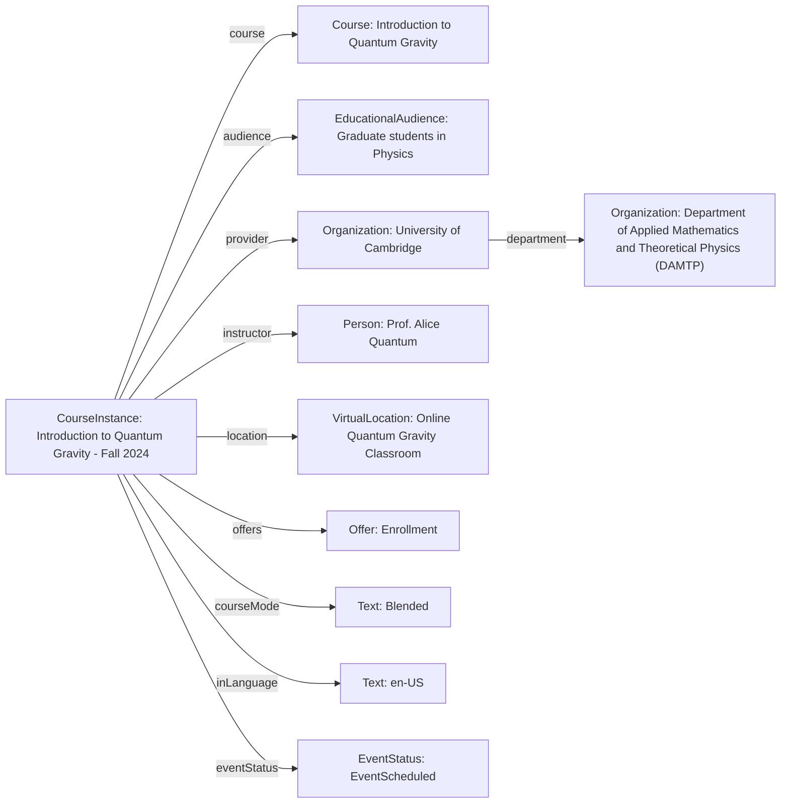

# Guidance for using CourseInstance

The [CourseInstance](http://schema.org/CourseInstance) profile fits into the schema.org hierarchy as follows:

[Thing](http://schema.org/Thing) > [Event](http://schema.org/Event) > [CourseInstance](http://schema.org/CourseInstance)

## Example using CourseInstance
A specific instance of a graduate-level course instance, offered in a blended format, focusing on the foundational concepts and modern theories of quantum gravity, provided by a leading university.

### JSON-LD code

```json
{
    "@context": "https://schema.org",
    "@type": "CourseInstance",
    "http://purl.org/dc/terms/conformsTo": {
        "@id": "https://bioschemas.org/profiles/Course/1.0-RELEASE",
        "@type": "CreativeWork"
    },
    "name": "Introduction to Quantum Gravity - Fall 2024",
    "description": "An intensive graduate-level course instance for the Fall 2024 semester, exploring the current theoretical frameworks and challenges in unifying quantum mechanics with general relativity, including string theory, loop quantum gravity, and emergent gravity concepts. This course will be delivered in a blended format, combining online lectures with in-person discussion sessions.",
    "courseMode": "Blended",
    "startDate": "2024-09-02",
    "endDate": "2024-12-13",
    "course": {
        "@type": "Course",
        "name": "Introduction to Quantum Gravity",
        "description": "This is the general curriculum for the Quantum Gravity course, covering advanced topics in theoretical physics.",
        "coursePrerequisites": "Graduate-level knowledge of Quantum Mechanics and General Relativity.",
        "educationalCredentialAwarded": "Certificate of Completion"
    },
    "location": {
        "@type": "VirtualLocation",
        "url": "https://university.example.edu/quantum-gravity-virtual-classroom",
        "name": "Online Quantum Gravity Classroom"
    },
    "provider": {
        "@type": "Organization",
        "name": "University of Cambridge",
        "department": {
            "@type": "Organization",
            "name": "Department of Applied Mathematics and Theoretical Physics (DAMTP)"
        },
        "url": "https://www.damtp.cam.ac.uk/"
    },
    "instructor": {
        "@type": "Person",
        "name": "Prof. Alice Quantum",
        "url": "https://university.example.edu/prof-quantum-profile",
        "affiliation": {
            "@type": "Organization",
            "name": "University of Cambridge, DAMTP"
        }
    },
    "audience": {
        "@type": "EducationalAudience",
        "audienceType": "Graduate students in Physics",
        "educationalLevel": "Graduate"
    },
    "inLanguage": "en-US",
    "offers": {
        "@type": "Offer",
        "price": "1500",
        "priceCurrency": "GBP",
        "url": "https://university.example.edu/quantum-gravity-enrollment-fall2024",
        "availability": "http://schema.org/InStock",
        "validFrom": "2024-06-01",
        "validThrough": "2024-08-15",
        "category": "Course Fee"
    },
    "maximumAttendeeCapacity": 100,
    "eventStatus": "http://schema.org/EventScheduled"
}
```

### Diagram

