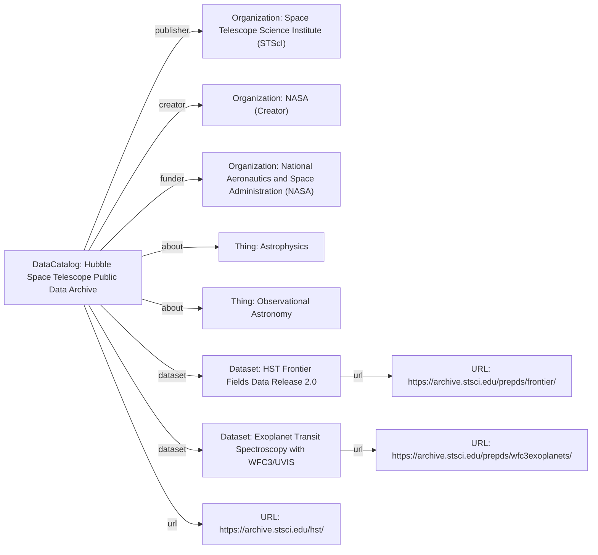

# Guidance for using DataCatalog

The [DataCatalog](/profiles/DataCatalog/) profile fits into the schema.org hierarchy as follows:

[Thing](http://schema.org/Thing) > [CreativeWork](http://schema.org/CreativeWork) > [DataCatalog](http://schema.org/DataCatalog)

## Example using DataCatalog
A comprehensive catalog of astronomical observations and derived data from the Hubble Space Telescope (HST), hosted by the Space Telescope Science Institute (STScI). This catalog provides access to a vast array of scientific datasets, ranging from planetary observations to deep-field cosmology.

### JSON-LD code

```json
{
    "@context": "https://schema.org",
    "@type": "DataCatalog",
    "http://purl.org/dc/terms/conformsTo": {
        "@id": "https://bioschemas.org/profiles/DataCatalog/0.4-RELEASE",
        "@type": "CreativeWork"
    },
    "name": "Hubble Space Telescope Public Data Archive",
    "description": "A comprehensive catalog providing access to all public data collected by the Hubble Space Telescope, including images, spectra, and time-series observations, alongside associated calibration and metadata.",
    "url": "https://archive.stsci.edu/hst/",
    "keywords": [
        "astronomy",
        "space telescope",
        "Hubble",
        "observational data",
        "cosmology",
        "galaxies",
        "stars",
        "planets"
    ],
    "publisher": {
        "@type": "Organization",
        "name": "Space Telescope Science Institute (STScI)",
        "url": "https://www.stsci.edu/"
    },
    "creator": {
        "@type": "Organization",
        "name": "NASA",
        "url": "https://www.nasa.gov/"
    },
    "funder": {
        "@type": "Organization",
        "name": "National Aeronautics and Space Administration (NASA)",
        "url": "https://www.nasa.gov/"
    },
    "about": [
        {
            "@type": "Thing",
            "name": "Astrophysics"
        },
        {
            "@type": "Thing",
            "name": "Observational Astronomy"
        }
    ],
    "citation": "Hubble Space Telescope Public Data Archive. Space Telescope Science Institute. DOI: 10.17909/T9BP4K (example DOI for data access)",
    "dateModified": "2023-10-26",
    "version": "1.0",
    "dataset": [
        {
            "@type": "Dataset",
            "name": "HST Frontier Fields Data Release 2.0",
            "description": "Data from the Hubble Frontier Fields program, focusing on observations of galaxy clusters acting as gravitational lenses, including imaging and spectroscopic data.",
            "url": "https://archive.stsci.edu/prepds/frontier/",
            "keywords": ["gravitational lensing", "galaxy clusters", "deep field", "cosmology"],
            "datePublished": "2018-04-15",
            "license": "https://creativecommons.org/publicdomain/zero/1.0/",
            "spatialCoverage": "RA: 10h00m00s, Dec: +02d00m00s",
            "temporalCoverage": "2013-10-01/2017-06-30"
        },
        {
            "@type": "Dataset",
            "name": "Exoplanet Transit Spectroscopy with WFC3/UVIS",
            "description": "Spectroscopic observations of exoplanet transits using the Wide Field Camera 3 (WFC3) and Ultraviolet/Visible (UVIS) channel, aimed at characterizing exoplanet atmospheres.",
            "url": "https://archive.stsci.edu/prepds/wfc3exoplanets/",
            "keywords": ["exoplanets", "spectroscopy", "atmospheres", "transit", "WFC3"],
            "datePublished": "2020-11-01",
            "license": "https://creativecommons.org/licenses/by/4.0/",
            "spatialCoverage": "Specific stellar targets",
            "temporalCoverage": "2010-01-01/2020-09-30"
        }
    ]
}
```

### Diagram

