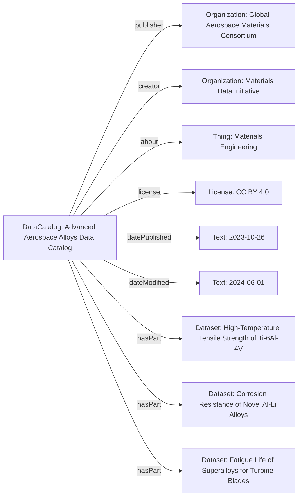

# Guidance for using DataCatalog

The [DataCatalog](http://schema.org/DataCatalog) profile fits into the schema.org hierarchy as follows:

[Thing](http://schema.org/Thing) > [CreativeWork](http://schema.org/CreativeWork) > [DataCatalog](http://schema.org/DataCatalog)

## Example using DataCatalog
A comprehensive catalog of datasets detailing the properties of advanced aerospace alloys, including experimental and computational data on their mechanical, thermal, and corrosion characteristics. This catalog is published by a global consortium and created by a materials data initiative.

### JSON-LD code

```json
{
    "@context": "https://schema.org",
    "@type": "DataCatalog",
    "http://purl.org/dc/terms/conformsTo": {
        "@id": "https://bioschemas.org/profiles/DataCatalog/0.3-DRAFT",
        "@type": "CreativeWork"
    },
    "name": "Advanced Aerospace Alloys Data Catalog",
    "description": "A curated collection of datasets containing experimental and computational data for advanced metallic alloys, specifically those relevant to aerospace applications. Includes mechanical, thermal, and corrosion properties.",
    "url": "https://aerospacealloysdata.org/catalog",
    "keywords": ["materials science", "aerospace alloys", "mechanical properties", "thermal properties", "corrosion resistance", "data standards", "metallurgy"],
    "publisher": {
        "@type": "Organization",
        "name": "Global Aerospace Materials Consortium",
        "url": "https://global-aerospace-materials.org/"
    },
    "creator": {
        "@type": "Organization",
        "name": "Materials Data Initiative",
        "url": "https://materials-data-initiative.org/"
    },
    "datePublished": "2023-10-26",
    "dateModified": "2024-06-01",
    "license": "https://creativecommons.org/licenses/by/4.0/",
    "about": {
        "@type": "Thing",
        "name": "Materials Engineering",
        "sameAs": "http://dbpedia.org/resource/Materials_science"
    },
    "hasPart": [
        {
            "@type": "Dataset",
            "name": "High-Temperature Tensile Strength of Ti-6Al-4V",
            "description": "Tensile strength data for Ti-6Al-4V alloy at various elevated temperatures and strain rates.",
            "url": "https://aerospacealloysdata.org/dataset/ti6al4v-tensile"
        },
        {
            "@type": "Dataset",
            "name": "Corrosion Resistance of Novel Al-Li Alloys",
            "description": "Experimental data on the electrochemical corrosion rates of new Aluminum-Lithium alloys in simulated saltwater environments.",
            "url": "https://aerospacealloysdata.org/dataset/alliali-corrosion"
        },
        {
            "@type": "Dataset",
            "name": "Fatigue Life of Superalloys for Turbine Blades",
            "description": "Cyclic fatigue life data and S-N curves for various nickel-based superalloys under high-cycle fatigue conditions.",
            "url": "https://aerospacealloysdata.org/dataset/superalloy-fatigue"
        }
    ]
}
```

### Diagram

