# Guidance for using FormalParameter

The [FormalParameter](/profiles/FormalParameter/) profile fits into the schema.org hierarchy as follows:

[Thing](http://schema.org/Thing) > [CreativeWork](http://schema.org/CreativeWork) > [FormalParameter](https://bioschemas.org/profiles/FormalParameter/1.0-RELEASE)

## Example using FormalParameter

A formal parameter defining the 'Simulation Temperature' for computational materials science simulations, such as Monte Carlo or Molecular Dynamics. This parameter specifies the thermal energy of the system in Kelvin, crucial for accurately modeling material properties under various conditions. It includes its typical range, default value, and links to examples of software and workflows where it's used.

### JSON-LD code

```json 
{
    "@context": "https://schema.org",
    "@type": "FormalParameter",
    "http://purl.org/dc/terms/conformsTo": {
        "@id": "https://bioschemas.org/profiles/FormalParameter/1.0-RELEASE",
        "@type": "CreativeWork"
    },
    "name": "Simulation Temperature",
    "description": "Defines the thermal energy of the system within a Monte Carlo or molecular dynamics simulation, typically expressed in Kelvin. This parameter influences the kinetic energy of particles and the system's phase behavior.",
    "keywords": ["materials science", "computational physics", "statistical mechanics", "simulation", "temperature", "Monte Carlo", "molecular dynamics"],
    "about": {
        "@type": "Thing",
        "name": "Computational Materials Science"
    },
    "creator": {
        "@type": "Organization",
        "name": "National Institute of Standards and Technology (NIST)",
        "url": "https://www.nist.gov/"
    },
    "dct:identifier": "https://example.org/formal-parameters/simulation-temperature-v1",
    "defaultValue": 300,
    "maxValue": 2000,
    "minValue": 0.1,
    "unitText": "Kelvin",
    "valueRequired": true,
    "valueType": {
        "@id": "http://schema.org/Number",
        "@type": "DataType"
    },
    "exampleOfWork": [
        {
            "@type": "SoftwareSourceCode",
            "name": "LAMMPS Molecular Dynamics Simulator",
            "url": "https://www.lammps.org/",
            "description": "A classical molecular dynamics code widely used for simulating particle systems, where temperature is a key input parameter."
        },
        {
            "@type": "CreativeWork",
            "name": "Grand Canonical Monte Carlo Workflow for Adsorption Studies",
            "url": "https://example.org/workflows/gcmc_adsorption_workflow",
            "description": "A computational workflow demonstrating the use of 'Simulation Temperature' for grand canonical Monte Carlo simulations of gas adsorption in porous materials."
        }
    ],
    "version": "1.0",
    "license": "https://creativecommons.org/licenses/by/4.0/"
}
```

### Diagram

```mermaid
graph TD
    FormalParameter_SimTemp["FormalParameter: Simulation Temperature"]
    
    subgraph Parameter Details
        FP_DefaultValue["defaultValue: 300"]
        FP_MaxValue["maxValue: 2000"]
        FP_MinValue["minValue: 0.1"]
        FP_UnitText["unitText: Kelvin"]
        FP_ValueRequired["valueRequired: true"]
        FP_Version["version: 1.0"]
        FP_License["license: CC BY 4.0"]
    end

    Thing_CompMatSci["Thing: Computational Materials Science"]
    Organization_NIST["Organization: National Institute of Standards and Technology (NIST)"]
    DataType_Number["DataType: Number"]
    SoftwareSourceCode_LAMMPS["SoftwareSourceCode: LAMMPS Molecular Dynamics Simulator"]
    CreativeWork_GCMCWorkflow["CreativeWork: Grand Canonical Monte Carlo Workflow"]

    FormalParameter_SimTemp -->|about| Thing_CompMatSci
    FormalParameter_SimTemp -->|creator| Organization_NIST
    FormalParameter_SimTemp -->|valueType| DataType_Number
    FormalParameter_SimTemp -->|exampleOfWork| SoftwareSourceCode_LAMMPS
    FormalParameter_SimTemp -->|exampleOfWork| CreativeWork_GCMCWorkflow

    FormalParameter_SimTemp --detaillink--> FP_DefaultValue
    FormalParameter_SimTemp --detaillink--> FP_MaxValue
    FormalParameter_SimTemp --detaillink--> FP_MinValue
    FormalParameter_SimTemp --detaillink--> FP_UnitText
    FormalParameter_SimTemp --detaillink--> FP_ValueRequired
    FormalParameter_SimTemp --detaillink--> FP_Version
    FormalParameter_SimTemp --detaillink--> FP_License

    style FP_DefaultValue fill:#f9f,stroke:#333,stroke-width:1px
    style FP_MaxValue fill:#f9f,stroke:#333,stroke-width:1px
    style FP_MinValue fill:#f9f,stroke:#333,stroke-width:1px
    style FP_UnitText fill:#f9f,stroke:#333,stroke-width:1px
    style FP_ValueRequired fill:#f9f,stroke:#333,stroke-width:1px
    style FP_Version fill:#f9f,stroke:#333,stroke-width:1px
    style FP_License fill:#f9f,stroke:#333,stroke-width:1px
```

