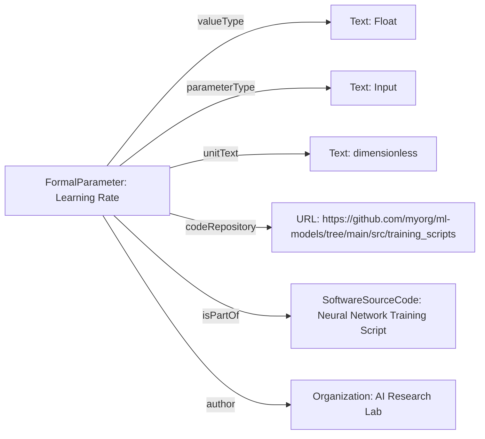

# Guidance for using FormalParameter

The [FormalParameter](https://bioschemas.org/profiles/FormalParameter/) profile fits into the schema.org hierarchy as follows:

[Thing](http://schema.org/Thing) > [CreativeWork](http://schema.org/CreativeWork) > [SoftwareSourceCode](http://schema.org/SoftwareSourceCode) > [FormalParameter](https://bioschemas.org/profiles/FormalParameter/)

!!! warning
    The following examples have been written with the support of generative AI and may be incomplete or inaccurate.
    Please [contact us](https://github.com/schemas-science/schemas-science.github.io/issues/new) with any feedback, suggestions or corrections.

## Example using FormalParameter
A `FormalParameter` representing the 'Learning Rate' in a machine learning neural network training script. This parameter defines the step size for updating model weights during optimization, crucial for controlling convergence and stability.

### JSON-LD code

```json
{
    "@context": "https://schema.org",
    "@type": "FormalParameter",
    "http://purl.org/dc/terms/conformsTo": {
        "@id": "https://bioschemas.org/profiles/FormalParameter/1.0-RELEASE",
        "@type": "CreativeWork"
    },
    "name": "Learning Rate",
    "description": "The step size at each iteration while moving toward a minimum of a loss function during neural network training. A critical hyperparameter in machine learning.",
    "keywords": ["machine learning", "hyperparameter", "neural network", "optimization", "deep learning"],
    "valueType": "Float",
    "defaultValue": 0.001,
    "minValue": 0.00001,
    "maxValue": 0.1,
    "parameterType": "Input",
    "unitText": "dimensionless",
    "identifier": "ml_param_learningRate_v1",
    "codeRepository": "https://github.com/myorg/ml-models/tree/main/src/training_scripts",
    "isPartOf": {
        "@type": "SoftwareSourceCode",
        "name": "Neural Network Training Script",
        "url": "https://github.com/myorg/ml-models/blob/main/src/training_scripts/train_nn.py"
    },
    "author": {
        "@type": "Organization",
        "name": "AI Research Lab",
        "url": "https://ai-research.org"
    },
    "dateCreated": "2023-10-26",
    "version": "1.0"
}
```

### Diagram

