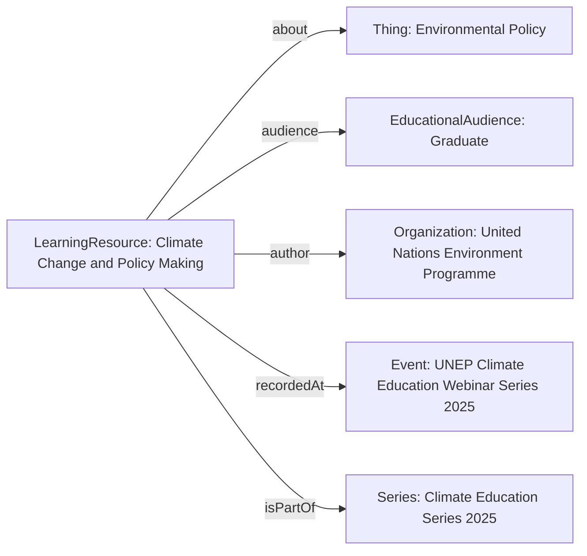

# Guidance for using TrainingMaterial

The [TrainingMaterial](/profiles/TrainingMaterial/) profile fits into the schema.org hierarchy as follows:

[Thing](http://schema.org/Thing) > [CreativeWork](http://schema.org/CreativeWork) > [LearningResource](http://schema.org/LearningResource)

## Example using LearningResource
A recorded webinar exploring the science of climate change and the complexities of policy-making processes. Aimed at graduate students and policy professionals.

### JSON-LD code

```json 
{
    "@context": "https://schema.org",
    "@type": "LearningResource",
    "name": "Climate Change and Policy Making",
    "description": "A webinar discussing the scientific basis of climate change and how international and national policies are shaped in response.",
    "keywords": ["climate change", "policy", "environmental science", "sustainability"],
    "audience": {
        "@type": "EducationalAudience",
        "educationalLevel": "Graduate"
    },
    "about": {
        "@type": "Thing",
        "name": "Environmental Policy"
    },
    "author": {
        "@type": "Organization",
        "name": "United Nations Environment Programme"
    },
    "creativeWorkStatus": "Published",
    "recordedAt": {
        "@type": "Event",
        "name": "UNEP Climate Education Webinar Series 2025",
        "startDate": "2025-04-15"
    },
    "isPartOf": {
        "@type": "Series",
        "name": "Climate Education Series 2025"
    }
}
```

### Diagram


